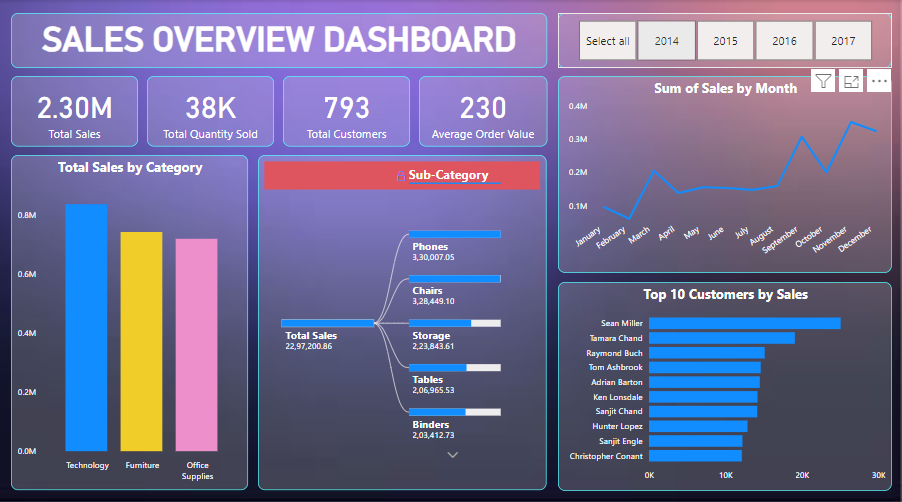
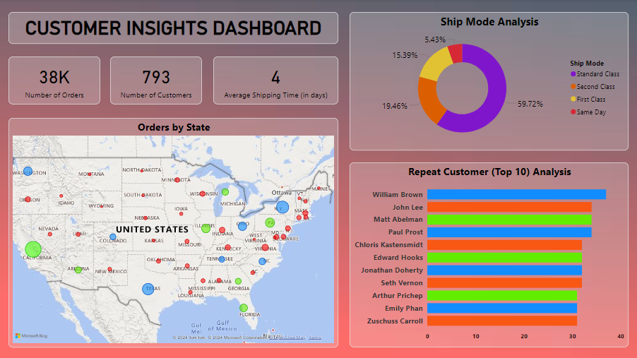
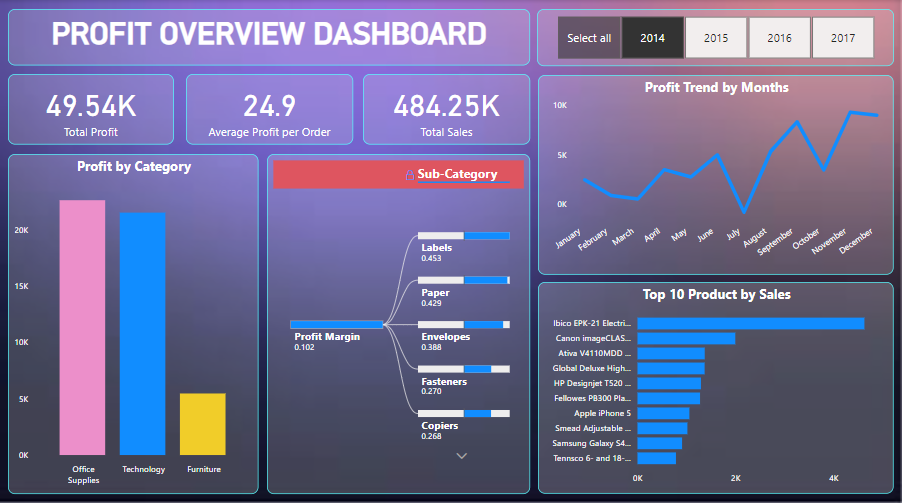
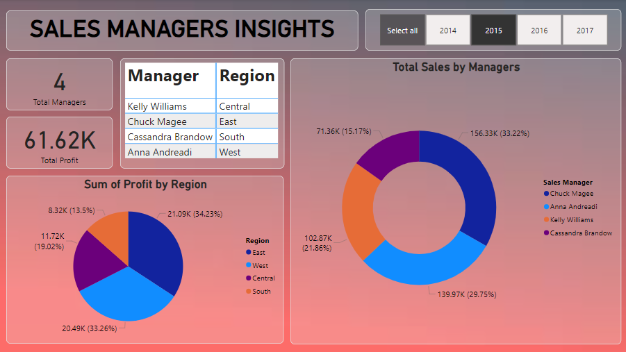

# Screenshots
This `screenshots/` folder contains four screenshots representing different dashboards created using the Superstore dataset. These screenshots provide a visual preview of the dashboards’ layout and design. The dashboards cover:

## **Sales Overview Dashboard**: A snapshot of total sales, quantity sold, customer count, and key performance indicators.
    
3. **Customer Insights Dashboard**: Displays customer-related data, including orders by state and repeat customers.
    
4. **Profit Overview Dashboard**: Highlights profit trends, total profit, and profit by category.
    
5. **Sales Managers Insights Dashboard**: Provides sales performance metrics and profit by region for different managers.
    
While these are static images, you can interact with the dashboards in the Power BI file (`superstore dashboard.pbix`) to explore data in real time.
